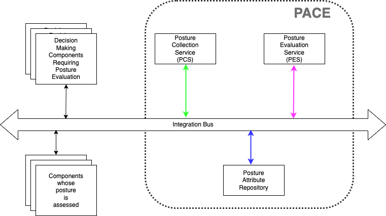
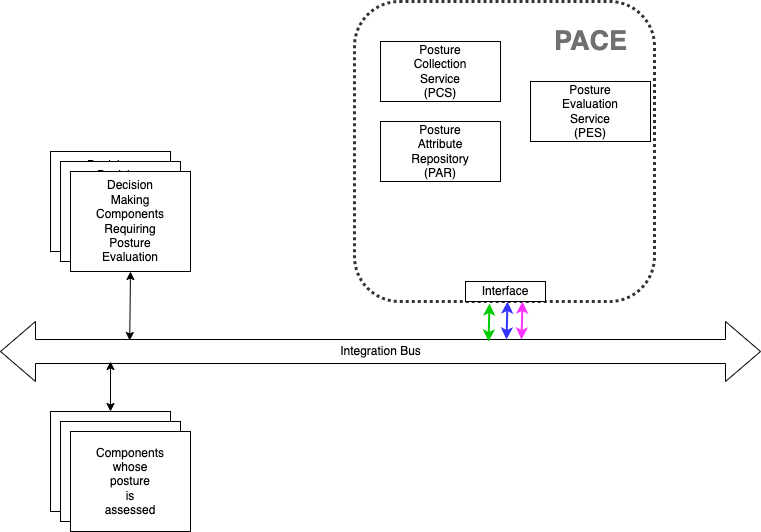
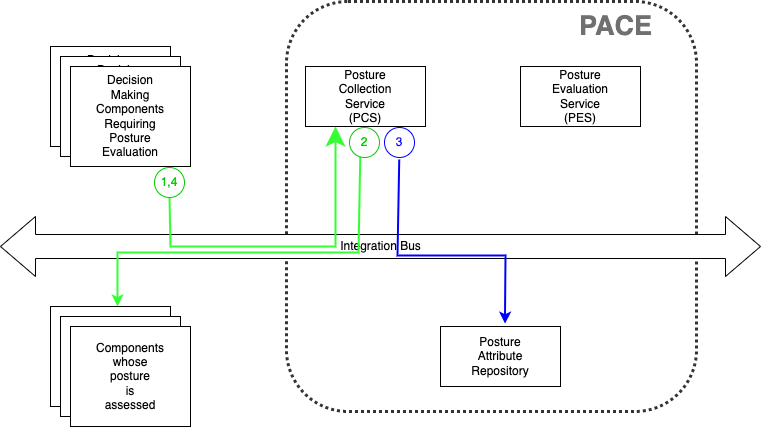
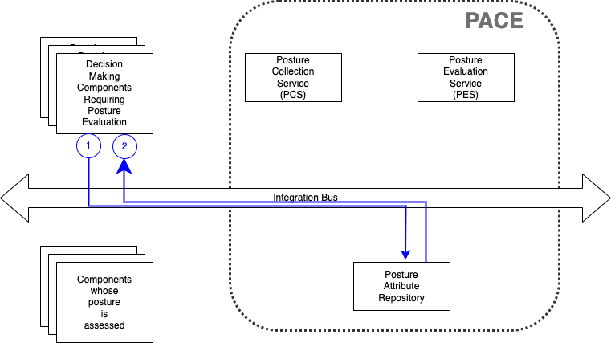

# PACE Architecture

PACE systems have 3 components:
- Posture Collection Service/System (PCS)
- Posture Attribute Repository (PAR)
- Posture Evaluation Service/System (PES)

The PCS is used in the use cases which collect posture attributes
and store those attributes in the PAR.

The PES is used in those use cases which obtain posture attributes
from the PAR and analyze the data.
The results of the analysis may be returned to the requesting
system or may be stored in the PAR as another type of attribute.

The PAR stores posture attributes.

Several PACE architectures are possible,
depending on an organizations needs.

## PACE Component Architecture

In this architecture,
the 3 components sit on the integration bus
directly and interact directly
with the decision making and sensing components.
This architecture allows for different vendors/implementations
for the different components.
With only a single instantiation of each component
(alternatives in later section),
each component must handle all types of posture attributes.

## Monolithic PACE Architecture

In this architecture,
the PACE system as an whole entity
sits on the integration bus.
PCS, PES, and PAR are not directly exposed.
However, if the PACE system implements all of the interfaces
in the previous section,
then this would be transparent to rest of the system.
This architecture might be favored by certain vendors
with an integrated solution.
Similar to the previous section,
with only a single instantiation
(alternatives in later section),
each component must handle all types of posture attributes.

## Multi-PACE

It is unrealistic for a single component
or a single integrated PACE system
to handle all possible posture attributes.
Therefore many organizations instantiating PACE
will have a mix of multiple component instantiations
and multiple monolithic PACE systems.

One reason might be different attributes
(e.g one for SBOM/VEX/NVD, one for situational awareness,
and one for data classification).

Another reason might be different vendors/open-source-projects.
P1-P14 are fourteen different products (e.g. from a vendor)
or projects (e.g. built from open source).

Yet another reason might be geographical.
E.g. One PCS for each of five regions.

In Figure 3 above, there are five PCS, four PAR, three PES and
two monolithic PACE systems,
each with there own interface to the integration bus.
Note the monolithic systems (P1,P2) interface as if they
were component systems as the monolithic API is just the
combined PCS/PAR/PES APIs.

## Use Cases Illustrating Interfaces

The following use cases highlight one example of each of:
- putting attributes into PACE
- getting attributes from PACE
- evaluating security posture using PACE

Note there are many more possible use cases for each bullet above.

### Putting an SBOM into PACE
This is one of many examples of interfacing with the PCS
to put an SBOM into PACE.
It assumes a decision making element (outside of PACE)
decides that PACE should add a particular SBOM from a particular
device.
This may be because the device was just added to the network,
and a comply-to-connect playbook is run.
Or it may because {add link to ips pace use case}
an intruder was discovered nearby and the security posture of this
enclave needs to be assessed.
This example assumes for this device the SBOM is resident on
the device and retrievable via OpenC2 command over the bus.

1. Decision-making element
(e.g a SOAR running a CACAO playbook eg  {fillinhere})
sends OpenC2 command, (eg {fillinhere}),
telling PCS to retrive SBOM from device_id=2345.

2. PCS receives command and sends OpenC2 commands
{fillinhere} to device, retreiving SBOM {fillinhere}

3. PCS stores info in PAR via OpenC2 command(s) {fillinhere}

4. PCS notifies Decision-Making Element command completed successfully {fillinhere}

### Getting VEX information from PACE
This assumes some other element of the system
needs attributes from PACE.
This example assumes that either no evaluation is necessary
(eg retrieve the SBOM, as is, from previous example)
or that any evaluation as already been done and is stored
in the PAR as just another attribute
(eg the risk level of a particular device based on SBOM, VEX, NVD).

1. Decision-making element sends OpenC2 command to retrieve
attribute (eg. a device SBOM as in {fillinhere})

2. PAR replies

### Evaluating Risk from a new CVE
