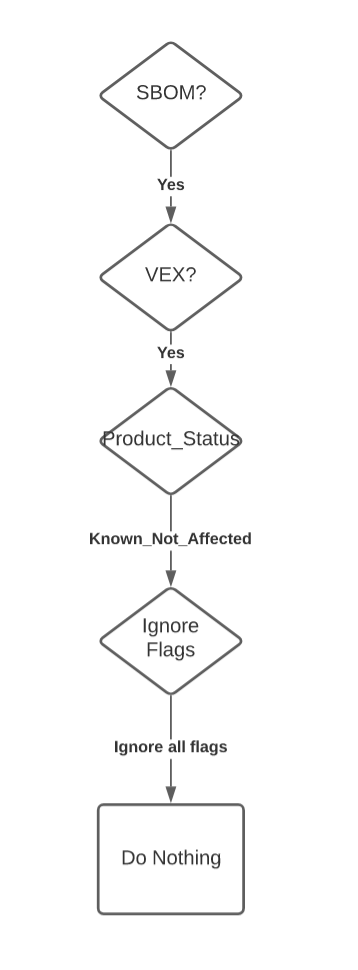
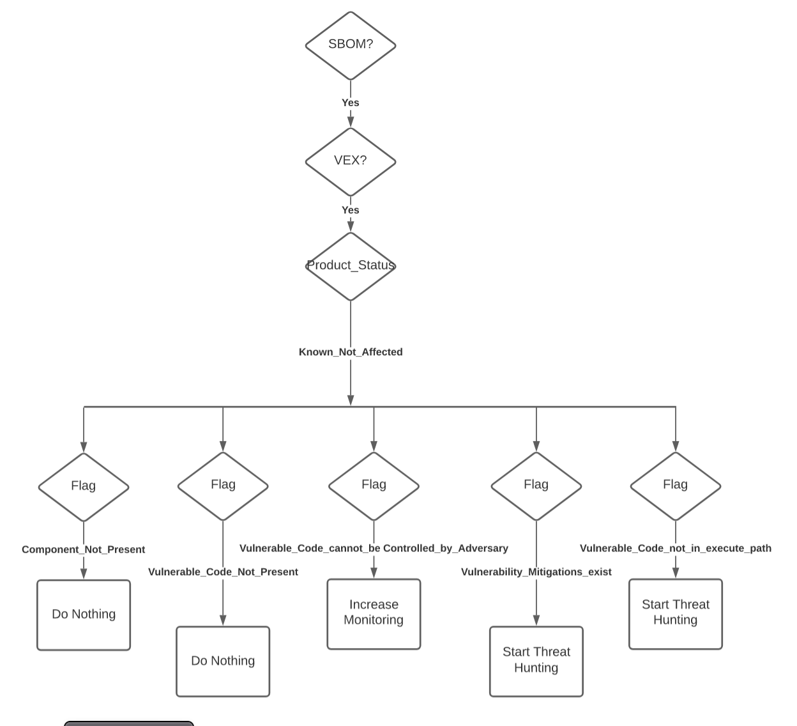
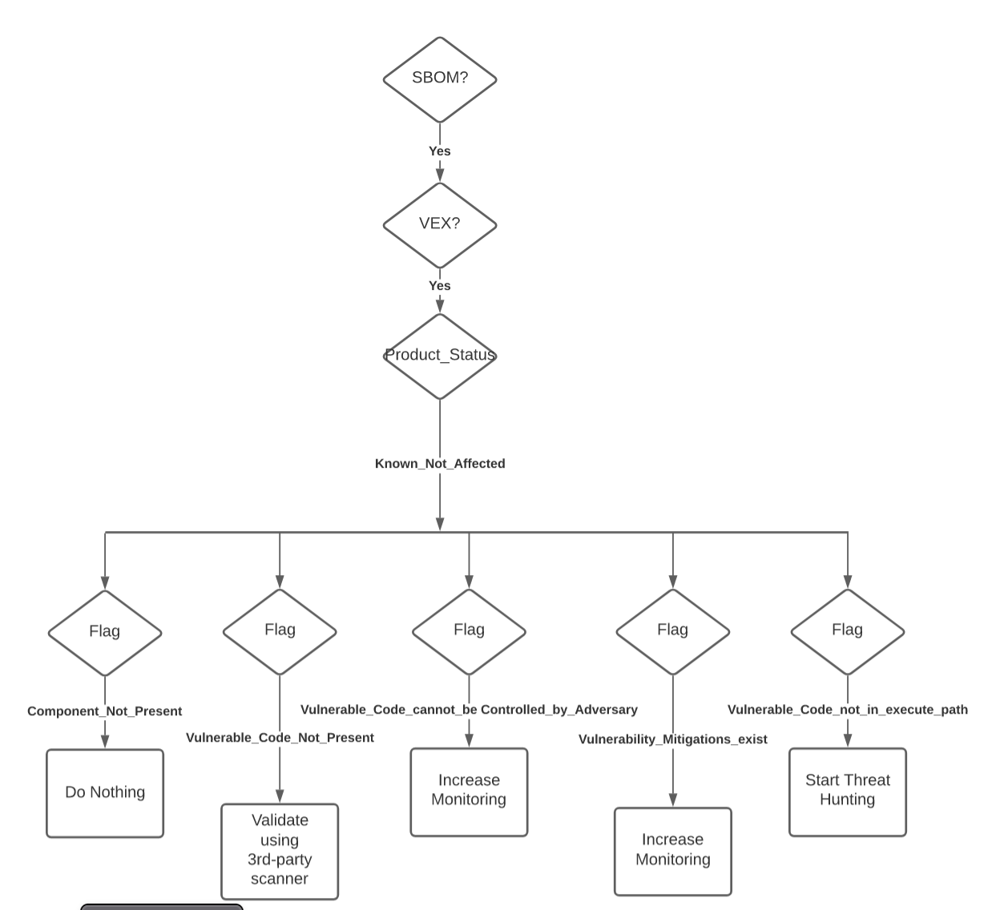

# PACE Use Cases for VEX "flags"

## Table of Contents
- [Intro](#intro)
- [Situation](#situation)
- [Industry/Organization](#industryorganization)
- [Infrastructure Systems](#infrastructure-systems)
   + [IACD](#iacd)
- [Assets](#assets)
- [Attributes](#attributes)
- [Parameters](#parameters)
- [Playbooks](#playbooks)
- [Security Policies](#security-policies)
- [Implementing Use Cases](#implementing-use-cases)
- [VEX Flag Distinctions](#vex-flag-distinctions)
   + [Not_Affected Flags](#notaffected-flags)
   + [Affected Flags](#affected-flags)
   + [Under Investigation](#underinvestigation)
   + [Fixed](#fixed)
- [Use Cases](#use-cases)
   + [Simplified Examples for Flags](#simplified-examples-for-flags)
   + [Healthcare Use Cases](#healthcare-use-cases)
   + [Automotive Use Cases](#automotive-use-cases)
   + [Public Utilities Use Cases](#public-utilities-use-cases)
   + [Government Use Cases](#government-use-cases)
   + [Consumer Electronics Use Cases](#consumer-electronics-use-cases)
   + [Cybersecurity Vendor Use Cases](#cybersecurity-vendor-use-cases)

## Intro
This directory was created to explain some PACE usecases
showing different playbooks/actions for different settings
of VEX flags in different environments.

These are an extension of the initial
[PACE IPS use case](../ips-pcs-pes-usecase.md),
combined with use cases created for the SBOM Healthcare Proof of Concept
(eventually need link),
and then further extended
to differentiate the potential uses of the different flags.

These are realistic (aka complex) use cases
and hence there are many elements for a given use case.
The following sections will define the values these elements can take.
Any given use case will have:
- situation (e.g. "Criminal hackers are currently in the system")
- industry (e.g. "healthcare")
- organization (e.g. "General Hospital")
- infrastructure systems (e.g. BestInClass intrusion detection system, Stixshifter, PACE PES/PCS/PAR, ...)
- attributes (e.g. asset type, triage scale, SBOMs, VEXs)
- parameters (e.g. asset type = respirator, triage = life threatening, SBOM = incomplete CycloneDx, ...)
- assets (both micro e.g. mri47 with particular attributes/parameters, and macro e.g. 234 "level 1" devices with SBOMs and VEXs)
- playbooks (e.g. CACAO playbook to handle a particular set of conditions)
- security policies (e.g. company 1 may choose to lump several/all VEX flags together while company 2 may choose to do different actions on "not affected"/"component_not_present" than on "not affected"/"vulnerable_code_not_in_execute_path")

One input into the decision making will be the VEX flags
but there will be others as well.
For example, the relative risk of a given medical device
causing loss of life due to cyber compromise vs
the risk of loss of life due to unavailability of the device
while it is offline being updated.

## Situation
Which playbook/actions are executed depends on the situational
environment at the time.
The situations for this set of use cases are:
- I. all quiet
- II. criminal hackers in various stages of infiltrating an organization for financial gain
- III. foreign nation state hackers in various stages of infiltrating an organization to gain intelligence
- IV. foreign nation state hackers in various stages of infiltrating a hospital to decrease US military combat readiness (ie to hurt or kill US Military personnel)

The situation (ie quiet, criminal, intel, casualties)
will be one of the inputs
into the decision making engine.

## Industry/Organization
Which playbook/actions are executed will also depend on the
policies of the organization.
Different organizations will have different
budgets, expertise, technologies, and priorities.
And these will be informed/influenced by the industry they are in.
The industries/organizations for this set of use cases are:
- (A) healthcare
   + General Hospital
   + East Podunk Rural Community Hospital
   + Military Base Hospital
   + Platinum-MDM
   + GarageShop-MDM
- (B) automotive
   + TopTen Auto
   + Goldstar Seatbelts
   + FlyByNight Navigation Software
- (C) public utilities
   + Bestest Gas & Electric
   + West Podunk Rural Electric Coop
   + Titanium Generators
   + Worstest Measurement Systems
- (D) government
   + Military Base Hospital
   + US Agency of Examples (USAOE)
   + Commission on Historical Anachronisms
   + Beltway Bandits POAM Software Systems
   + Ace Accreditation Services
- (E) consumer electronics
   + ACME Webcams
   + Sketchy Alarm Clock Ventures
- (F) cybersecurity vendor
   + BestInClass IDS
   + Feigned-Intelligence AI

See [Industries](./industries.md) for how to convert use case
in one industry to another industry

## Infrastructure Systems
A distinction will be made between the organization systems
for executing these use cases (e.g. the security systems)
from the systems that these use cases are protecting
(e.g. the medical devices themselves).
The systems used to execute the PACE functionality,
or other cybersecurity functionality that takes action
based on PACE evaluation,
will be called "infrastructure".
The systems that exist to carry out the mission of the organization
(eg medical devices in a hospital) will be called assets
which will be described in a later section.

### IACD
Execution of the use cases
will follow the
[IACD model](https://www.iacdautomate.org/)
of sensing, sense-making, decision-making, acting.

Sensing will be gaining input such as asset inventory,
SBOM, VEX, situational awareness, etc.
Sense-making will be combining inputs and augmenting information
to provide to decision making.
E.g. the combining of SBOM, VEX, and NVD information.
Decision making will be the control flow via predetermined playbooks
(some without human involvement, and some with humans in the decision path).
Acting will be the command and control
sent to the various security technologies
to implement the decision.

The use cases will, to the extent possible, attempt to be
vendor-agnostic and describe the functionality, not a
particular product or systems.
The exceptions may be PACE or other OCA subprojects (eg Kestrel, Stixshifter) where the OCA open source project may be mentioned.

## Assets
These are the systems being protected.
The systems doing the protecting will be called
infrastructure as described previously.

## Attributes
For the purpose of these use cases,
the primary attributes involve software
composition e.g. SBOM, VEX, NVD, etc.
Each of these may have individual parameters of their own,
which will be dealt with in the next section.
Other attributes which will affect the security posture
will be added later such as:
- threat intel (STIX) from a relevant ISAC,
- Kestrel info on an intruder already in the system,
- OSCAL
- SCAP
- ACAS
- XCCDF
- ...

## Parameters
### SBOM
- SBOM generation
   + source code SBOM
   + build time SBOM
   + post-build SBOM
- Completeness
   + complete
   + contains known-unknowns (i.e. specific denoted known-unknowns)
   + incomplete (i.e. unknowns are not specifically delineated)
   + not_present (i.e. there will be use cases for when there is no SBOM for that device)
- format/serialization/version
   + format = CycloneDX
      - serialization = xml or json (distinction will not matter for these use cases at this time)
   + format = SPDX
      - serialization = xml, json, ... (distinction will not matter for these use cases at this time)
   + For the purpose of these use cases at the moment, version of the format or serialization is being ignored  - but it is a parameter to be used by PACE
- version
   + for the purpose of these use cases at the moment, version of the SBOM is being ignored - but it is a parameter to be used by PACE
- note that for a given device, PACE PAR may contain more than one SBOM, of more than one format.
- different SBOMs for the same software (eg application x has a source code SPDX xml SBOM, a build time  CycloneDX JSON SBOM containing known-unknowns, and post-build analysis tool by-defintion-incomplete CycloneDX JSON SBOM) may have different levels of incompleteness and there may be discrepancies between them. Specific use cases (nothing to do with VEX) will be needed for these parameters.

### VEX
The primary purpose of these use cases is to show use cases that distinguish
different values of the VEX flags.
There are other parameters in VEX that can, and will, drive PACE evaluation.
But the focus of these use cases at the moment is:
- not_affected
   + Component_not_present
   + Vulnerable_code_not_present
   + Vulnerable_code_cannot_be_controlled_by_adversary
   + Vulnerable_code_not_in_execute_path
   + Vulnerability_mitigations__exist
- affected
   + vulnerable_code_is_controlled_by_adversary
   + known_exploits_in_the_wild
   + no_exploits_reported_in_the_wild_yet
   + default_configuration_not_affected
- under-investigation
- fixed

When "affected", the remediation
ie the action to be taken by the device operator,
is another VEX parameter
that will used.

### Triage
One parameter about assets is their impact on the operation
of the organization if they are compromised.
For example, a hospital may use 4 levels of criticality
according to the device impact on patient care and/or financial operations:
- level 1 - loss/compromise leads to likely loss of life
- level 2 - loss/compromise may lead reduced level of care
- level 3 - loss/compromise may lead to financial impact on business
- level 4 - loss/compromise for 1 day would not greatly impact patient care or financial operations

## Playbooks
need to fill this in with some actual CACAO playbooks
that get invoked in this docs use cases.
Probably put summary here and have playbooks as their own doc

## Security Policies
The various groups involved in creating these use cases are trying to not
presuppose organization security policies.
One of the reasons for having the VEX flags is to allow different organizations
to have different policies.
It also allows for organizations to have different policies
for different vendors (e.g. depending on previous track record,
country of origin, or some other trust factor).
Examples will be shown in the
[VEX Flag Distinctions](#vex-flag-distinctions)
section.
This document will not try to codify or list the security policies themselves.
It will just show the affect of the policy on the playbook or decision making.
For example based on their security policy,
company 1 may choose to always trust a particular vendor's VEX when it says
"not affected" and they will take the same actions independent of the value
of the flags.
However company 2 security policy may cause
different actions
on "not affected"/"component_not_present" (e.g. take no action)
than on "not affected"/"vulnerable_code_not_in_execute_path"
(e.g. kick off threat hunting on these systems).

## Implementing Use Cases

Architectures and systems will actually perform the functions
to implement the use cases.
Wrt sensing, at some point these use cases
will be augmented from
an [SBOM](https://www.cisa.gov/sbom)
viewpoint and actual applicable example SBOMs added.
Some examples of CDX, SPDX, SWID will all be included.
Some examples of "source code", "at-build", and "post-build" SBOMs -
and appropriate use cases - will be included.
Some example SBOMs for each of the licensing, security, and architecture
use cases will be included.

Wrt sense-making, at some point these use cases
will be augmented to include example relevant augmentation
algorithms and data
e.g. NVD, intrusion alerts,
[STIX](https://oasis-open.github.io/cti-documentation/stix/intro.html),
...

Wrt decision-making, at some point these use cases
will be augmented from a
[CACAO](https://docs.oasis-open.org/cacao/security-playbooks/v1.0/security-playbooks-v1.0.html)
viewpoint and actual applicable example playbooks added.

Wrt acting, at some point these use cases
will be augmented from an
[OpenC2](https://openc2.org/)
viewpoint and details of actions will include appropriate OpenC2 commands.

## VEX Flag Distinctions
### Not_Affected Flags
The actual use cases are in a following section.
A few examples are highligted here to distinguish why VEX flags are needed
and why the existing flags are necessary.
These simplified use cases were extracted from the more realistic/complicated
use cases in later sections.

- Use case I.E.01 shows security policy for a company which, in that scenario, chooses to always trust a particular vendor's "not affected" VEX; and they will take no action independent of the value
of the flags.
- Use case II.A.01 shows the security policy for a different company (than previous bullet) which, in that scenario trusts the vendor "not affected" when the "component_not_present" or the "Vulnerable_code_not_present" flag are set. However if the "Vulnerable_code_cannot_be_controlled_by_adversary" flag is set, then they take action to increase monitoring. If the "Vulnerable_code_not_in_execute_path" or the "Vulnerability_mitigations__exist" flags are set, company 2 policy kicks off active threat hunting in systems with either of these flags.
- Use case III.D.01 shows the security policy for company 3 is very similar to the company in the previous bullet, but with the important distinction that they invoke a 3rd-party scanner to validate "Vulnerable_code_not_present". They ncrease monitoring instead of starting threat hunting for "Vulnerability_mitigations__exist".

The following figures show the differences between the use cases
based on the flags.

**I.E.01**

*****

**II.A.01**

*****

**III.D.01**

### Affected Flags
A few examples are highlighted here to distinguish why VEX flags are needed
for "affected".
- Use case I.B.01 shows the security policy for a company that, in that situation, can afford to shut off all affected devices independent of the affected flags.
- Use case I.D.01 shows the security policy for Military Hospital that in the this situation (as opposed to the situation in next bullet which is same company but different policy/actions due to different conditions). This situation is affected devices with default_configuration_not_affected and no_exploits_reported_in_the_wild_yet.
   + playbook to shut down the level 4 affected devices regardless of flags. Recall devices with criticality level 4 can afford to be lost for 1 day without impact on patient care or finances.
   + playbook to kick off automated configuration on the affected level 2&3 devices. Recall level 3 are necessary financial systems and level 2 are system which could potentially impact patient care.
   + playbook to kick off threat hunting on all level 1 devices independent of affected or flags. Recall level 1 systems could lead to loss of life if compromised.
- IV.D.01 is Military Hospital but the situation is different than the previous bullet. Both the ISAC and the Intelligence Community have informed the hospital there is credible evidence that malefactors are trying to kill hospital patients using a particular TTP. Threat hunting at the hospital has detected adversaries are already in the system. The vendor, Platinum MDM, has issued a new vex with known_exploits_in_the_wild based on input from their customers. The hospital issues it's own VEX, for internal consumption by it's automated systems, with the vulnerable_code_is_controlled_by_adversary flag set which results in:
   + playbook to shut down ALL level 4 devices, affected or not
   + playbook to shut down affected level 3 devices
   + playbook to increase monitoring on remaining level 3 devices, and all level 1&2 devices
   + playbook to kick off threat hunting on all level 1 & 2 devices, additional resources are enabled, calling in outside help, invoking insurance clauses, as well as involving law enforcement and CISA
   + Board of Directors informed

### Under_investigation
Use cases will need to be added for Under_investigation eventually
but not directly affecting the flag discussions
(unless someone comes up with a need for under_investigation flags)

### fixed
Use cases will need to be added for "fixed" eventually
but not directly affecting the flag discussions
(unless someone comes up with a need for "fixed" flags)

## Use Cases
Use case naming will contain Situation.Industy.number.
For example in I.A.1, "I" means situation is "quiet" (ie no known hackers in their system).
The "A" means it's a Healthcare Industry scenario.
The "O1" means it's the first IA use case.
This naming scheme will probably need changing once more use cases exist
and we determine how best to organize them.

### Simplified Examples for Flags
- [Use Case I.E.01 All Quiet Consumer Electronics 1](./usecase_IE01.md)
- [Use Case II.A.01 Criminal Intrusion Healthcare](./usecase_IIA01.md)
- [Use Case III.D.01 Foreign Intelligence Government](./usecase_IIID01.md)
- [Use Case I.B.01 All Quiet Automotive 1](./usecase_IB01.md)
- [Use Case I.D.01 All Quiet Government](./usecase_IB01.md)
- [Use Case IV.D.01 Killer Government/Healthcare](./usecase_IB01.md)

### Healthcare Use Cases
- Use Case ...
- Use Case ...

### Automotive Use Cases
- Use Case ...
- Use Case ...

### Public Utilities Use Cases
- Use Case ...
- Use Case ...

### Government Use Cases
- Use Case ...
- Use Case ...

### Consumer Electronics Use Cases
- Use Case ...
- Use Case ...

### Cybersecurity Vendor Use Cases
- Use Case ...
- Use Case ...
