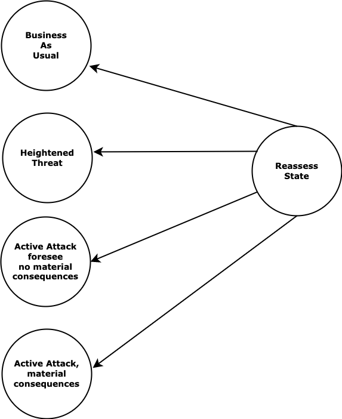

# Enterprise Security Posture

In this example, the enterprise
(a large company or a large government agency)
has a very complex security posture based on many factors
across many internal organizations
located in many places.
But for the purpose of an executive dashboard,
the security posture is bucketed into one of
four states:
- Business As Usual
- Heightened Threat
- Active Attack, no known material consequences foreseen
- Active Attack with material consequences

This Enterprise Security Posture is maintained within PACE
based on the enterprise security policies, posture attributes
within PACE, and algorithms whose details are not relevant to
understanding this use case.
The policies, data, and algorithms were developed after
much internal debate on what is normal, what rates higher attention,
alerting management, or even material impact that must be
reported to SEC or other regulatory bodies.
The calculation of which state the enterprise is currently,
is done by the PES function within PACE.

This Enterprise Security Posture is used as data in many other
PACE usecases.
E.g. different playbooks may be run when under attack.
This includes both initiating playbooks
(eg to set up incident response) but also taking different paths
within playbooks (e.g. BAU may do nothing about a
particular vulnerability in a
particular asset, but when under attack additional
resources may be brought in for enhanced monitoring of this device).

Many other use cases will be developed concerning the details
beneath this high level overview.

