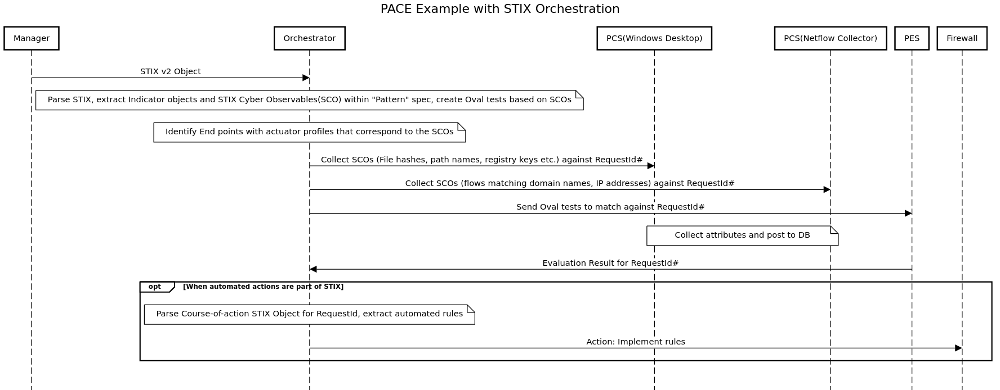

# PACE Example with STIX Orchestration

The idea is to use PCS and PES to peform a threat hunting exercise. A SOC administrator would initiate the action by looking for an IOC in STIX format, aka STIX Cyber Observables(SCO).

STIX SCOs contain *indicator* object to describe the indicators in an attack, and this object in turn contains  a *pattern* object that specifices the indicators such as a registry key, IP address.  A logical combination of various indicators can be expressed in the pattern specification, for example domain-name=x.y.z OR ipv4-address=1.2.3.4. See [here](https://oasis-open.github.io/cti-documentation/stix/examples) for examples. This follows that PCS can be used to collect the indicators attributes from various/targetted machines and PES to evaluate the result of the pattern evaluation.

In this scenario, the Manager component of SACM architecture would receive a request from the SOC admin to start the hunting, given the SCO. Manager would determine an appropriate Orchestrator that can take in a STIX object and return a verdict. See [complete flow here](./Images/stix-pcs-pes-usecase.png), shown below.



# Optional Course of Action

The hunting use case can be extended to automatic remediation. STIX leaves out automated course of action in its *COA* object definition. CACAO playbooks could be used to represent the remediation action. Probably a reference to the playbook can be embedded in the STIX COA object. Then Orchestrator can send the remediation action to the appropriate actuators using OpenC2. Alternately, Manager can intiate the remediation automatically or through SOC admin request.

## Discussion Topics
1. Should OVAL test be used to express the logical combination of indicators in the pattern specification?
2. What new OpenC2 Actions should be created to accommodate the collection and evaluation needed by the above?
3. Should remediation be included in the PACE POC?


### Text for Sequencea Diagram
```
title PACE Example with STIX Orchestration

Manager->Orchestrator: STIX v2 Object
note over Orchestrator: Parse STIX, extract Indicator objects and STIX Cyber Observables(SCO) within "Pattern" spec, create Oval tests based on SCOs
note over Orchestrator: Identify End points with actuator profiles that correspond to the SCOs
Orchestrator->PCS(Windows Desktop):Collect SCOs (File hashes, path names, registry keys etc.) against RequestId#
Orchestrator->PCS(Netflow Collector): Collect SCOs (flows matching domain names, IP addresses) against RequestId#
Orchestrator->PES: Send Oval tests to match against RequestId#
note over PCS(Windows Desktop), PCS(Netflow Collector): Collect attributes and post to DB
PES->Orchestrator: Evaluation Result for RequestId#
opt When automated actions are part of STIX
note over Orchestrator: Parse Course-of-action STIX Object for RequestId, extract automated rules
Orchestrator->Firewall: Action: Implement rules
end
```
